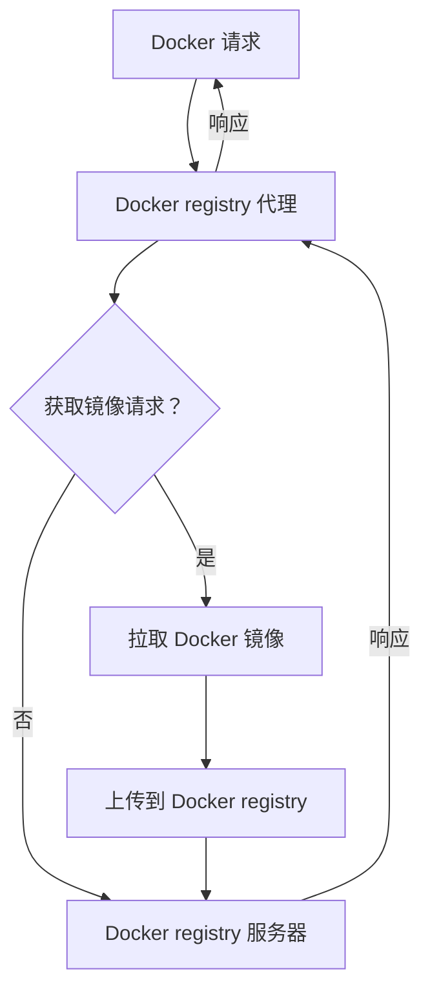

# Swift Registry

简体中文 | [English](./i18n/README.us-en.md)

本项目旨在快速搭建一个基于 Docker 的私有仓库。起初，该项目仅用于创建一个 Docker 私有仓库，但现已扩展支持 `npm`、`Maven`、`PyPI` 等仓库，未来还将支持更多类型的仓库。用户无需担心代理问题，只需配置一个订阅，软件将自动配置到各个仓库使用，并且所有流量仅在对应容器中使用，确保安全和高效。

## 🌟 特性

- [x] `Docker`
- [x] `Maven`
- [x] `npm`
- [x] `PyPI`
- [ ] `APT`
- [ ] `Yum(RPM)`
- [ ] `Cargo`
- [ ] `Conda`

## 🛠️ 安装

<details>
<summary>Docker</summary>

```bash
$ ./ctl docker install
```

</details>

<details>
<summary>npm</summary>

```bash
$ ./ctl npm install
```

</details>

<details>
<summary>Maven</summary>

```bash
$ ./ctl maven install
```

</details>

<details>
<summary>PyPI</summary>

```bash
$ ./ctl pypi install
```

</details>

## 💡 尝试

```bash
git clone https://github.com/shencangsheng/easy-registry-mirror.git
cd easy-registry-mirror
chmod +x ctl
./ctl help
./ctl docker help
./ctl docker install
```

## 📖 功能

1. 代理 Docker registry
2. 自动同步 Docker 镜像
3. npm 私有仓库
4. Maven 私有仓库
5. PyPI 私有仓库
6. npm fastestmirror

## 🔮 未来功能

1. APT
2. Yum(RPM)
3. Cargo
4. Conda
5. Go registry
6. Maven fastestmirror
7. PyPi fastestmirror

## 📖 原理

该方案通过代理层处理所有 Docker 请求。对于拉取镜像的请求，代理层会先将镜像上传到私有 Docker Registry，然后再转发请求并响应。此策略避免了定期同步 DockerHub 镜像带来的流量和存储浪费。系统还支持根据预定义列表每周自动同步镜像。执行 `./ctl docker sync help` 了解更多。



## 👍 依赖库

这些开源库用于创建本项目。

- [shencangsheng/registry-mirror-proxy](https://github.com/shencangsheng/registry-mirror-proxy)
- [verdaccio/verdaccio](https://github.com/verdaccio/verdaccio)
- [sonatype/nexus3](https://github.com/sonatype/docker-nexus3)
- [RubyMetric/chsrc](https://github.com/RubyMetric/chsrc)

## 🤔 如何使用代理

已无法正常拉取 Dockerhub 镜像，[下载](https://github.com/shencangsheng/easy-registry-mirror/releases/tag/artifacts)项目所需要的基础镜像，运行 `gunzip -c xxx.tar.gz | docker load` 来载入镜像，`./ctl proxy help` 来了解如何使用**代理**。

## 🤝 特别致谢

1. **fastestmirror** 功能，特别感谢 [RubyMetric/chsrc](https://github.com/RubyMetric/chsrc) 项目提供的软件支持

## 📝 许可证

A short snippet describing the license (MIT)

MIT © Cangsheng Shen
