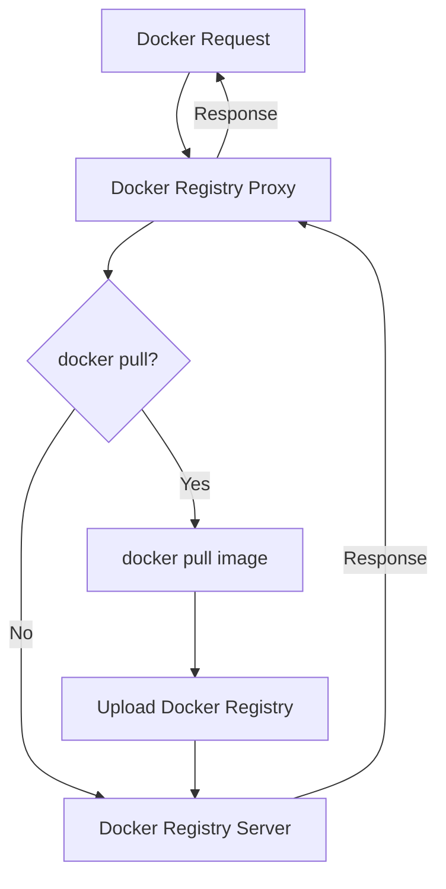

# Easy Registry Mirror

简体中文 | [English](./i18n/README.us-en.md)

在日渐严峻的网络下，无论是公司还是个人，自建仓库是非常必要的，这个项目用于快速搭建一个`Docker`私有仓库，并且无需修改已运行的`Dockerfile`/`docker-compose.yaml`，几乎没有迁移成本；未来会支持更多`npm`、`Maven`、`pip`等仓库。

## Trying

```bash
git clone https://github.com/shencangsheng/easy-registry-mirror.git
cd easy-registry-mirror
chmod +x ctl
./ctl help
./ctl docker install
./ctl docker sync help
```

## Features

1. Docker Registry
2. Auto Sync Docker Images

## Upcoming Features

1. npm Registry

## Principle



## Credits

This project was inspired by the [shencangsheng/registry-mirror-proxy](https://github.com/shencangsheng/registry-mirror-proxy) available in the GitHub project.

## 疑难杂症

如果你的服务器已经无法 pull 到镜像了，那么在项目的 `Releases` 下载项目所需要的镜像，在服务器运行 `gunzip -c xxx.tar.gz | docker load` 来载入镜像，`./ctl magic help` 来了解如何使用

## License

A short snippet describing the license (MIT)

MIT © Cangsheng Shen
