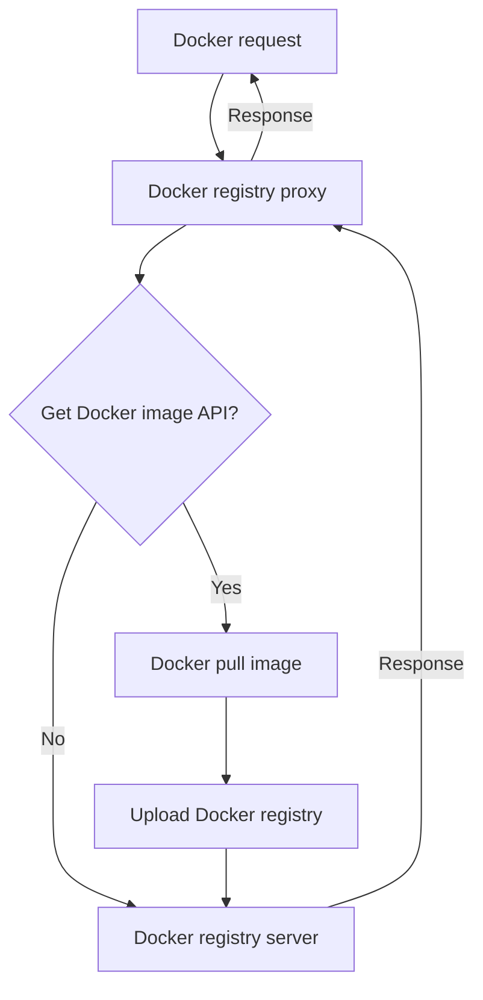

# Easy Registry Mirror

简体中文 | [English](./i18n/README.us-en.md)

在国内日渐严峻的网络下，无论是公司还是个人，自建仓库都是非常有必要的，这个项目用于快速搭建一个`Docker`私有仓库，并且无需修改已运行的`Dockerfile`/`docker-compose.yaml`，几乎没有迁移成本；未来会支持更多`npm`、`Maven`、`PyPI`等仓库。

## Trying

```bash
git clone https://github.com/shencangsheng/easy-registry-mirror.git
cd easy-registry-mirror
chmod +x ctl
./ctl help
./ctl docker help
./ctl docker install
./ctl magic help
./ctl npm help
./ctl maven help
./ctl pypi help
./ctl status
```

## Registry

- [x] `Docker`
- [x] `Maven`
- [x] `npm`
- [x] `PyPI`
- [ ] `APT`
- [ ] `Yum(RPM)`
- [ ] `Cargo`
- [ ] `Go registry`

## Features

1. Proxy Docker registry
2. Auto sync Docker images
3. npm registry
4. Maven registry
5. PyPI registry
6. 本次 **fastestmirror** 功能感谢 [RubyMetric/chsrc](https://github.com/RubyMetric/chsrc) 提供的软件支持，可以对所有源进行测速
7. npm fastestmirror

## Upcoming Features

1. APT
2. Yum(RPM)
3. Cargo
4. Conda
5. Go registry
6. Maven fastestmirror
7. PyPi fastestmirror

## Principle

原理是 Docker 的所有请求会先进入代理层，代理判断是否为获取镜像请求，代理层会先将镜像上传到 Docker registry 中，再转发请求到 Docker registry 中并响应；这样的策略与常见定期同步 Dockerhub 镜像不同的是，仅获取所需的镜像，避免流量和存储的过渡浪费。但依然提供了根据列表每周自动同步镜像的功能，执行 `./ctl docker sync help` 来了解如何使用



## Libraries Used

These open source libraries were used to create this project.

- [shencangsheng/registry-mirror-proxy](https://github.com/shencangsheng/registry-mirror-proxy)
- [verdaccio/verdaccio](https://github.com/verdaccio/verdaccio)
- [sonatype/nexus3](https://github.com/sonatype/docker-nexus3)
- [RubyMetric/chsrc](https://github.com/RubyMetric/chsrc)

## Proxy

如果已经因为网络无法获取到镜像，可以点击 [Releases](https://github.com/shencangsheng/easy-registry-mirror/releases/tag/v1.4.0) 下载项目所需要的基础镜像，运行 `gunzip -c xxx.tar.gz | docker load` 来载入镜像，`./ctl magic help` 来了解如何使用**代理**。

## License

A short snippet describing the license (MIT)

MIT © Cangsheng Shen
