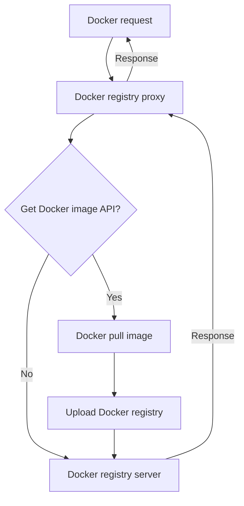

# Easy Registry Mirror

简体中文 | [English](./i18n/README.us-en.md)

**Easy Registry Mirror** 旨在帮助开发者快速搭建一个私有的 `Docker` 仓库，并且无需修改已运行的 `Dockerfile` 或 `docker-compose.yaml`，几乎没有迁移成本。此外，本项目还支持 Maven、npm 和 PyPI 的私有仓库，未来将支持更多仓库。

在国内网络环境日益严峻且不稳定的情况下，无论是企业还是个人，自建仓库变得愈发必要。工具可以极其容易在不同私有仓库中使用**魔法**，能够有效解决网络不稳定带来的困扰。

## Trying

```bash
git clone https://github.com/shencangsheng/easy-registry-mirror.git
cd easy-registry-mirror
chmod +x ctl
./ctl help
./ctl docker help
./ctl docker install
./ctl npm help
./ctl maven help
./ctl pypi help
./ctl status
```

## Features

1. Proxy Docker registry
2. Auto sync Docker images
3. npm registry
4. Maven registry
5. PyPI registry

## Upcoming Features

1. APT
2. Yum(RPM)
3. Conda
4. Go registry

## Principle

原理是 Docker 的所有请求会先进入代理层，代理判断是否为获取镜像请求，代理层会先将镜像上传到 Docker registry 中，再转发请求到 Docker registry 中并响应；这样的策略与常见定期同步 Dockerhub 镜像不同的是，仅获取所需的镜像，避免流量和存储的过渡浪费。但依然提供了根据列表每周自动同步镜像的功能，执行 `./ctl docker sync help` 来了解如何使用



## Credits

This project was inspired by the [shencangsheng/registry-mirror-proxy](https://github.com/shencangsheng/registry-mirror-proxy) available in the GitHub project.

This project was inspired by the [verdaccio/verdaccio](https://github.com/verdaccio/verdaccio) available in the GitHub project.

This project was inspired by the [sonatype/nexus3](https://github.com/sonatype/docker-nexus3) available in the GitHub project.

## Magic

如果已经因为网络无法获取到镜像，可以点击 [Releases](https://github.com/shencangsheng/easy-registry-mirror/releases/tag/v1.2.0) 下载项目所需要的基础镜像，运行 `gunzip -c xxx.tar.gz | docker load` 来载入镜像，`./ctl magic help` 来了解如何使用**魔法**。

## License

A short snippet describing the license (MIT)

MIT © Cangsheng Shen
