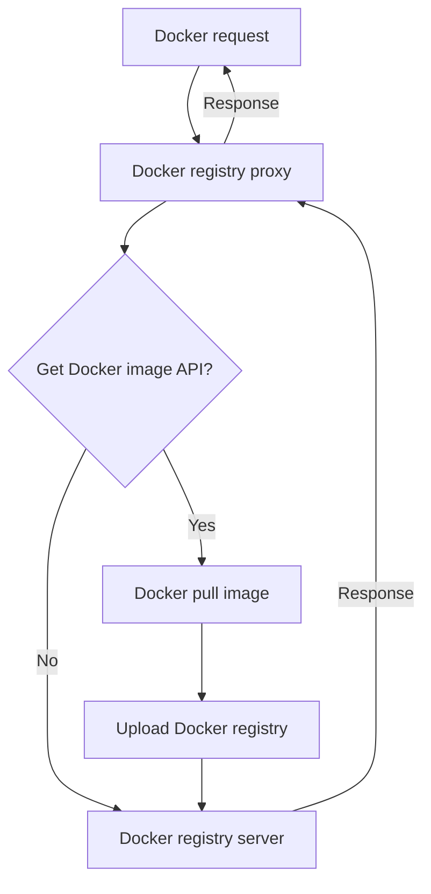

# Easy Registry Mirror

English | [简体中文](https://github.com/shencangsheng/easy-registry-mirror)

**Easy Registry Mirror** aims to help developers quickly set up a private Docker repository without the need to modify existing `Dockerfile` or `docker-compose.yaml` files, resulting in almost zero migration cost. Additionally, this project supports private repositories for Maven, npm, and PyPI, with plans to support more repositories in the future.

## Trying

```bash
git clone https://github.com/shencangsheng/easy-registry-mirror.git
cd easy-registry-mirror
chmod +x ctl
./ctl help
./ctl docker help
./ctl docker install
./ctl magic help
./ctl npm help
./ctl maven help
./ctl pypi help
./ctl status
```

## Features

1. Proxy Docker registry
2. Auto sync Docker images
3. npm registry
4. Maven registry
5. PyPI registry

## Upcoming Features

1. APT
2. Yum(RPM)
3. Conda
4. Go registry

## Principle

The principle is that all Docker requests first go through a proxy layer. The proxy determines whether the request is for fetching an image. If so, the proxy uploads the image to the Docker registry before forwarding the request to the Docker registry and responding. This strategy differs from the common approach of periodically synchronizing Docker Hub images by only fetching the required images, thus avoiding unnecessary traffic and storage waste. However, it still provides the functionality to automatically sync images weekly based on a list. Execute `./ctl docker sync help` to learn how to use this feature.



## Credits

This project was inspired by the [shencangsheng/registry-mirror-proxy](https://github.com/shencangsheng/registry-mirror-proxy) available in the GitHub project.

This project was inspired by the [verdaccio/verdaccio](https://github.com/verdaccio/verdaccio) available in the GitHub project.

This project was inspired by the [sonatype/nexus3](https://github.com/sonatype/docker-nexus3) available in the GitHub project.

## License

A short snippet describing the license (MIT)

MIT © Cangsheng Shen
