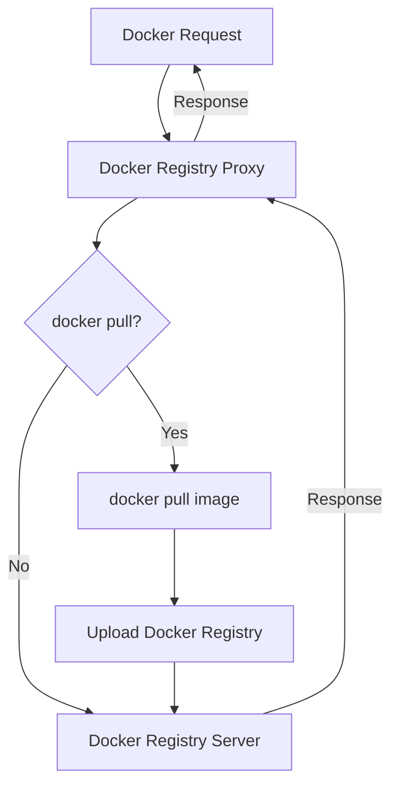

# Easy Registry Mirror

English | [简体中文](https://github.com/shencangsheng/easy-registry-mirror)

In today's increasingly challenging environment, it is essential for both companies and individuals to start building their own repositories. This project facilitates the rapid setup of a private `Docker registry` without requiring any modifications to existing `Dockerfile` or `docker-compose.yaml` files, ensuring minimal migration costs. Future support will include additional repositories such as `npm`, `maven`, and `pip`.

The principle is that all requests to Docker first enter the proxy layer. The proxy determines if the request is for fetching a Docker image, and if so, it uploads the image to the Docker Registry before forwarding the request to the Docker Registry and responding. Unlike the common practice of periodically synchronizing Docker Hub images, this strategy only fetches the necessary images, avoiding excessive traffic and storage waste. However, it still provides the functionality to automatically synchronize images based on a list weekly. To learn how to use it, execute `./ctl docker sync help`.

## Trying

```bash
git clone https://github.com/shencangsheng/easy-registry-mirror.git
cd easy-registry-mirror
chmod +x ctl
./ctl help
./ctl docker install
./ctl docker sync help
```

## Features

1. Docker Registry
2. Auto Sync Docker Images

## Upcoming Features

1. npm Registry

## Principle



## Credits

This project was inspired by the [shencangsheng/registry-mirror-proxy](https://github.com/shencangsheng/registry-mirror-proxy) available in the GitHub project.

## Problem

If your server can no longer pull images, download the required images from the project's `Releases`. On your server, run `gunzip -c xxx.tar.gz | docker load` to load the images. Use `./ctl magic help` to learn how to use the project.

## License

A short snippet describing the license (MIT)

MIT © Cangsheng Shen
